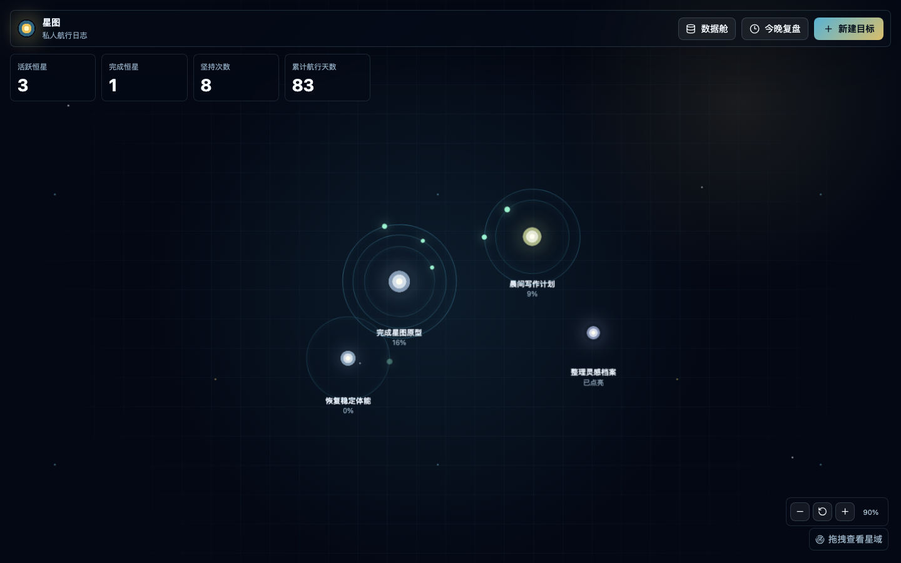
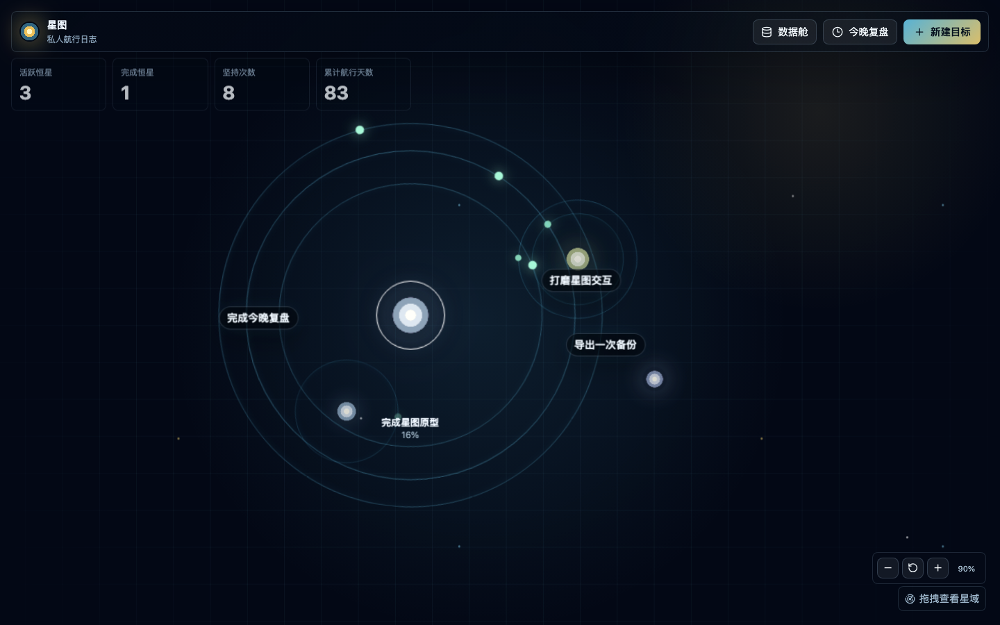
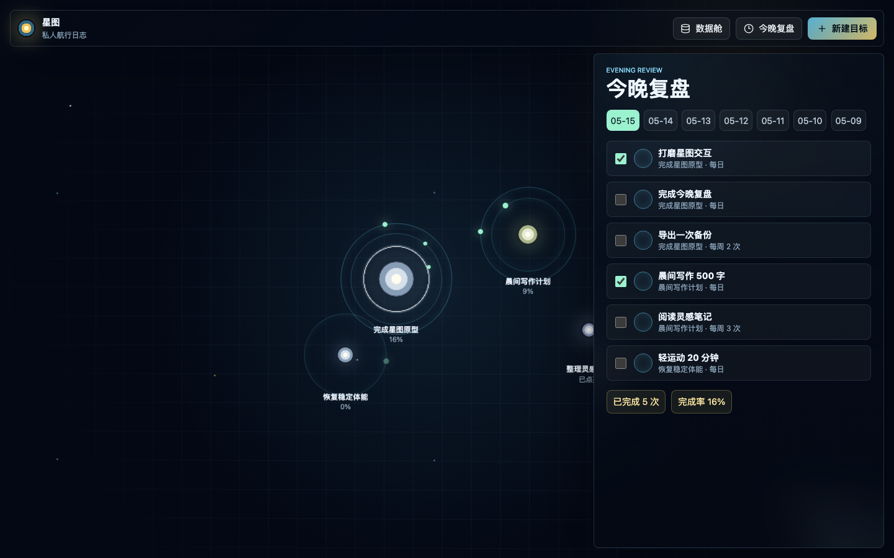
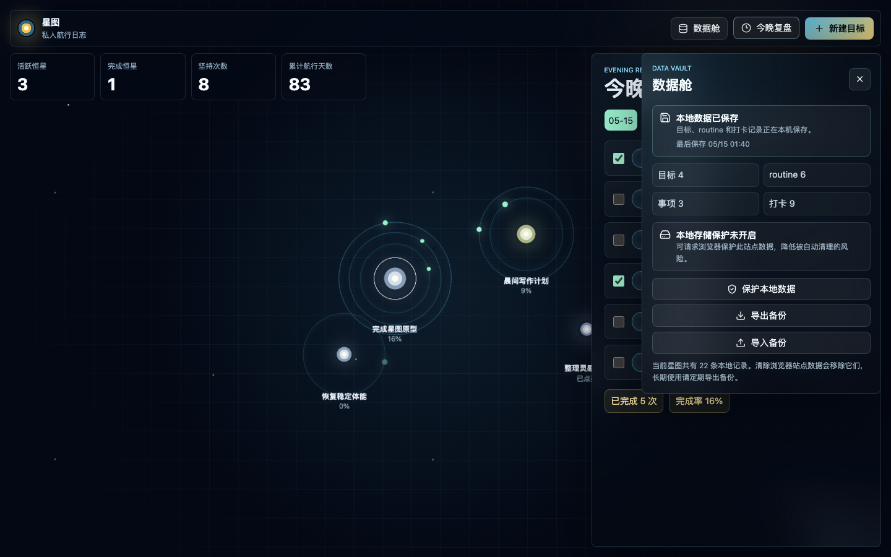

# 星图目标管理

星图目标管理是一款由「空杯」创作的目标规划工具。它把长期目标、日常 routine、临时事项、复盘记录和本地备份组织成一张可交互的可视化星图，让计划不只停留在清单里，而是成为可以持续点亮、推进和回望的成长路径。

这个仓库分成三个清晰工程：Web/PWA、iOS 原生版和 macOS 原生版。Web 版已经可用，iOS 与 macOS 版以 SwiftUI 原生体验为目标，逐步把同一套目标管理逻辑迁移到 Apple 平台。

## 项目定位

星图目标管理关注的是个人长期目标的持续推进，而不是单纯的待办清单。它用一套偏宇宙航行的隐喻来组织信息：

- 恒星：一个长期目标，例如完成作品、建立习惯、推进学习计划。
- 行星轨道：围绕目标运转的 routine，例如每日写作、每周复盘、定期备份。
- 点亮记录：每一次完成 routine 都会变成星图里的推进痕迹。
- 今晚复盘：每天收束当前状态，查看哪些 routine 已完成、哪些还需要补记。
- 数据舱：本地存储、备份导出、备份导入和数据保护入口。

核心想法很简单：让目标管理有一点仪式感，但不牺牲日常使用效率。

## 截图预览

### 星图总览



### 恒星聚焦



### 今晚复盘



### 数据舱与本地备份



## 当前功能

- 可视化星图：目标以恒星形式展示，routine 以轨道和行星形式围绕目标呈现。
- 目标管理：创建目标、编辑目标、设置开始日期和截止日期、标记目标完成。
- routine 管理：支持每日 routine 与每周固定次数 routine。
- 今日点亮：在目标详情或星图近景中快速完成当日 routine。
- 今晚复盘：集中查看当天应完成的 routine，并支持最近 7 天补记。
- 临时事项：给目标添加一次性任务，适合临时推进点。
- 数据舱：显示本地数据状态、目标/routine/事项/打卡数量。
- 本地备份：支持 JSON 导出与导入，便于迁移和长期保存。
- 本地持久化：Web 版使用浏览器本地存储保存星图数据。
- PWA 基础：Web 版包含 manifest 与 service worker，可作为渐进式 Web 应用继续完善。

## 工程结构

```text
.
├── web/                  # React + Vite Web/PWA 版本
├── ios/StarfieldGoals/   # SwiftUI iOS 原生版本
├── macos/StarfieldGoals/ # SwiftUI macOS 原生版本
├── docs/assets/          # README 截图与文档资源
└── README.md
```

## Web 版

Web 版是当前最完整、最适合体验的版本，使用 React、TypeScript 和 Vite 构建。

### 本地运行

```bash
cd web
npm install
npm run dev -- --port 4173
```

打开：

```text
http://127.0.0.1:4173/
```

### 常用验证

```bash
cd web
npm test
npm run build
npm run e2e
```

## iOS 原生版

iOS 版位于 `ios/StarfieldGoals/`，目标是提供 SwiftUI 原生 iPhone 体验，并使用 SwiftData + CloudKit 私有数据库同步 App 自有数据。

当前标准框架已经建立，后续按 TestFlight / App Store 发布流程继续完善。纯 Swift 规则层可以通过 SwiftPM runner 验证：

```bash
cd ios/StarfieldGoals
swift run StarfieldGoalsCoreChecks
```

覆盖方向包括日期区间、7 天补打窗口、每日/每周 routine 展示、目标统计和 Web PWA `AppState version: 1` JSON 导入导出。

## macOS 原生版

macOS 版位于 `macos/StarfieldGoals/`，目标是构建真正的 SwiftUI 原生 macOS App，不使用 Electron，也不使用 WKWebView 套壳。

用 Xcode 打开：

```bash
open macos/StarfieldGoals/StarfieldGoals.xcodeproj
```

命令行验证：

```bash
cd macos/StarfieldGoals
xcodebuild -project StarfieldGoals.xcodeproj -scheme StarfieldGoals -configuration Debug build CODE_SIGNING_ALLOWED=NO
swift build
swift test
```

详细方案见 [macos/StarfieldGoals/PROJECT_PLAN.md](macos/StarfieldGoals/PROJECT_PLAN.md)。

## 数据与隐私

Web 版默认把数据保存在浏览器本地存储中，不依赖远程服务器。你可以通过数据舱导出 JSON 备份，也可以在更换设备或浏览器后导入备份恢复星图。

需要注意的是，浏览器清理站点数据可能会移除本地星图数据。长期使用时建议定期导出备份。

## 路线图

- 完善 Web/PWA 的安装体验和离线体验。
- 提升星图交互，包括更细腻的聚焦动画、缩放手感和多目标布局。
- 打磨 macOS 原生版的窗口体验、菜单命令、通知和本地备份流程。
- 推进 iOS 版 SwiftData + CloudKit 同步能力。
- 统一 Web、iOS、macOS 之间的 JSON 备份格式和迁移路径。

## 作者

Created by 「空杯」.
