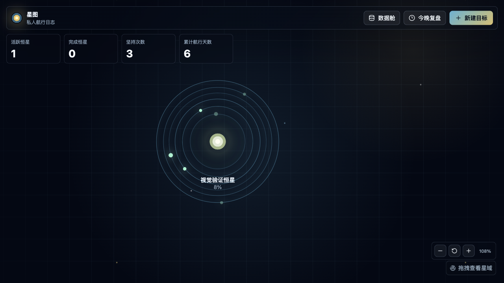

# 星图目标管理

星图目标管理是一款由「空杯」创作的目标规划工具。它把目标、任务、复盘和进度追踪组织成一张可视化星图，让长期计划不再只是列表里的文字，而成为可以持续点亮、推进和回望的成长路径。



这个仓库分成两个清晰工程：

- `web/`：当前可用的 React/Vite Web/PWA 版本。
- `macos/`：准备开发的原生 SwiftUI macOS 版本。

## Web 版

```bash
cd web
npm run dev -- --port 4173
```

继续使用 `http://127.0.0.1:4173/`，浏览器里的旧数据会留在同一个本地存储域下。

常用验证：

```bash
cd web
npm test
npm run build
npm run e2e
```

## macOS 原生版

工程骨架在 `macos/StarfieldGoals/`。第一版目标是用 SwiftUI 原生实现核心目标管理与星图体验，不使用 Electron，也不使用 WKWebView 套壳。

详细方案见 [macos/StarfieldGoals/PROJECT_PLAN.md](macos/StarfieldGoals/PROJECT_PLAN.md)。

## ios 原生版

已开发完成，等待上架App Store...
